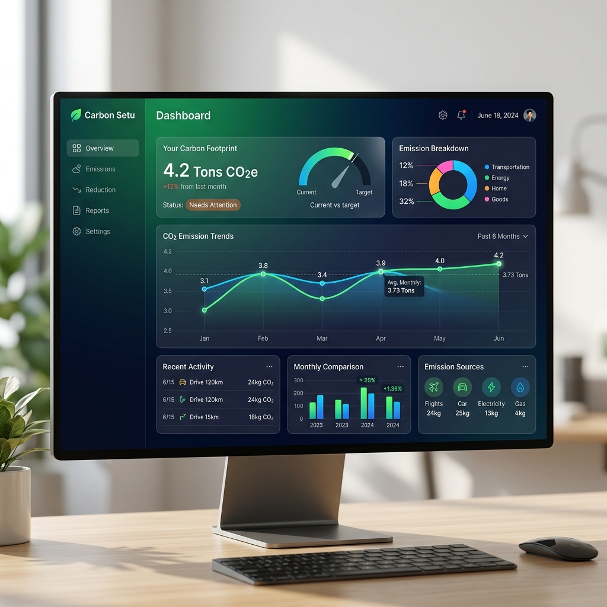
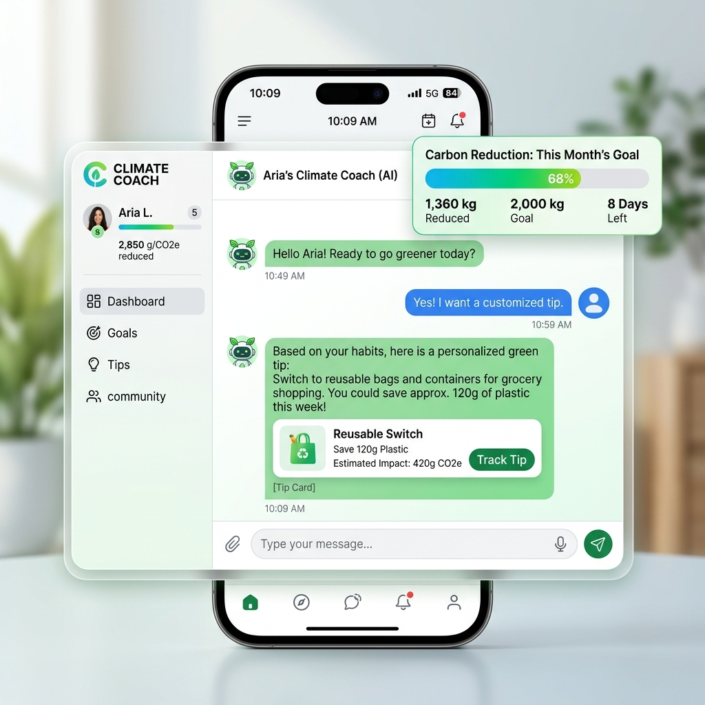
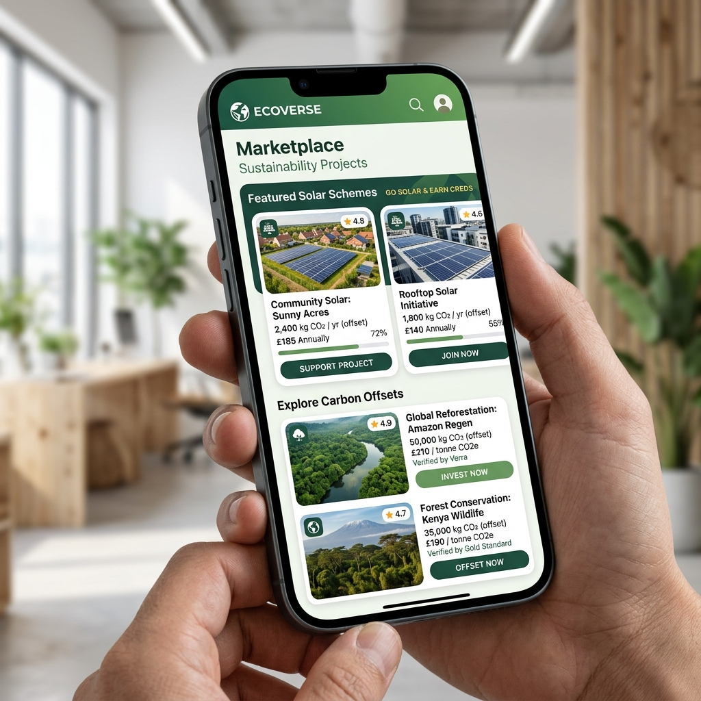

# 🌿 Carbon Setu UI

> **Empowering a Sustainable Future through Intelligent Carbon Tracking & Offsetting.**

---

[](https://reactjs.org/)
[](https://vitejs.dev/)
[](https://tailwindcss.com/)
[](https://www.typescriptlang.org/)
[](https://opensource.org/licenses/MIT)

**Carbon Setu** is a premium, high-performance web application designed to help individuals and organizations monitor, manage, and mitigate their carbon footprint. Utilizing modern web technologies and AI-driven insights, Carbon Setu provides a "bridge" (*Setu*) between current habits and a greener lifestyle.

---

## 📸 Visual Showcase

<p align="center">
  
</p>

<p align="center">
  
  
</p>

---

## ✨ Key Features

### 📊 Advanced Analytics & Dashboard
*   **Real-time Emissions Tracking**: Visualize your daily, monthly, and yearly carbon footprint with high-fidelity charts powered by Chart.js and Recharts.
*   **Intuitive Summary Cards**: Get instant insights into your top emission sources and overall progress.
*   **Interactive Calendars**: Log activities and track historical data through a sleek, responsive calendar interface.

### 🤖 AI Climate Coach
*   **Personalized Recommendations**: Receive AI-generated suggestions tailored to your lifestyle to effectively reduce emissions.
*   **Intelligent Forecasting**: Predict future emission trends based on historical data to stay ahead of your sustainability goals.

### 🛒 Sustainability Marketplace
*   **Carbon Offsetting**: Browse and invest in verified carbon offset projects.
*   **Solar Schemes**: Explore local and global solar energy initiatives and government schemes to transition to clean energy.

### 🏆 Engagement & Achievements
*   **Milestone Tracking**: Earn achievements as you hit key reduction targets.
*   **Daily Challenges**: Participate in daily tasks designed to build sustainable habits.

---

## 🛠️ Technology Stack

- **Frontend Core**: [React 19](https://reactjs.org/)
- **Build Tool**: [Vite](https://vitejs.dev/)
- **Styling**: [Tailwind CSS](https://tailwindcss.com/) & [Radix UI](https://www.radix-ui.com/) (for premium, accessible components)
- **Data Visualization**: [Chart.js](https://www.chartjs.org/) & [Recharts](https://recharts.org/)
- **State Management**: [Zustand](https://github.com/pmndrs/zustand)
- **Forms & Validation**: [React Hook Form](https://react-hook-form.com/)
- **Type Safety**: [TypeScript](https://www.typescriptlang.org/)

---

## 🚀 Getting Started

### Prerequisites

- [Node.js](https://nodejs.org/) (Version 18 or higher recommended)
- [npm](https://www.npmjs.com/) or [yarn](https://yarnpkg.com/)

### Installation

1.  **Clone the Repository**:
    ```bash
    git clone https://github.com/SHIVAYAGARWAL08/CARBON-SETU.git
    cd CARBON-SETU/frontend
    ```

2.  **Install Dependencies**:
    ```bash
    npm install
    ```

3.  **Run Development Server**:
    ```bash
    npm run dev
    ```
    The application will be available at `http://localhost:5173`.

---

## 📂 Project Structure

```text
CARBON-SETU/
├── frontend/
│   ├── src/
│   │   ├── components/       # UI Components (Buttons, Charts, etc.)
│   │   ├── hooks/            # Custom React Hooks
│   │   ├── lib/              # Utility functions
│   │   ├── types/            # TypeScript Interfaces
│   │   └── App.tsx           # Main Application Entry
│   ├── package.json          # Project Metadata & Scripts
│   └── tsconfig.json         # TypeScript Configuration
└── README.md
```

---

## 🗺️ Roadmap

- [ ] Mobile App Integration (Native)
- [ ] Multi-user Organization Accounts
- [ ] Integration with IoT Smart Meters
- [ ] Global Sustainability Leaderboard

---

## 🤝 Contributing

Contributions are welcome! Please feel free to submit a Pull Request.

1.  Fork the Project
2.  Create your Feature Branch (`git checkout -b feature/AmazingFeature`)
3.  Commit your Changes (`git commit -m 'Add some AmazingFeature'`)
4.  Push to the Branch (`git push origin feature/AmazingFeature`)
5.  Open a Pull Request

---

## 📄 License

Distributed under the MIT License. See `LICENSE` for more information.

---

<p align="center">Made with ❤️ for a Greener Planet</p>
